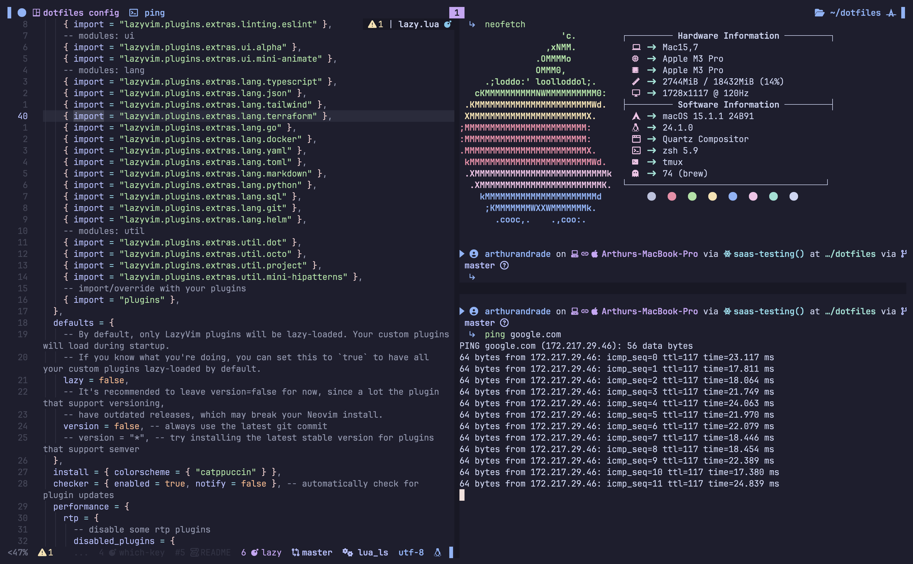
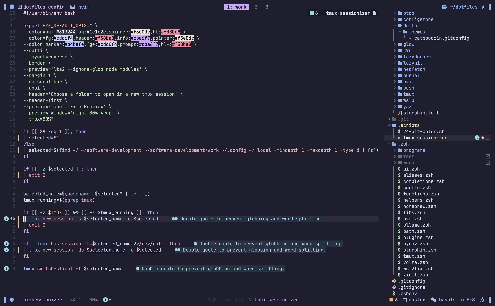

# 🌟 My Dotfiles (DEPRECATED)

Welcome to my dotfiles repository!
This setup is built for a **zsh** shell environment, with carefully tuned configurations for **tmux** and **Neovim** to enhance productivity and developer happiness.

This setup is built for myself and is just a source of inspiration. I'm ok with you copying everything, but I'll probably not be giving support to all platforms and shells.

---

## ✨ Preview

Here's a sneak peek of what your terminal could look like after applying these dotfiles:

**Terminal (zsh + tmux + Neovim):**


**Neovim in action:**


---

## 🚀 Getting Started

Follow these steps to reproduce this setup on your own machine.

### Prerequisites

Make sure you have the following installed:

- **zsh**: Install using your package manager (e.g., `brew install zsh` or `sudo apt install zsh`).
- **tmux**: A terminal multiplexer (e.g., `brew install tmux` or `sudo apt install tmux`).
- **Neovim**: A modern Vim-based editor (e.g., `brew install neovim` or `sudo apt install neovim`).
- **GNU Stow**: For managing and symlinking dotfiles (e.g., `brew install stow` or `sudo apt install stow`).

---

### 1️⃣ Clone the Repository

```bash
git clone https://github.com/arthur404dev/dotfiles.git ~/dotfiles
cd ~/dotfiles
```

---

### 2️⃣ Backup Your Existing Configuration

If you have existing configurations for zsh, tmux, or Neovim, back them up first:

```bash
mv ~/.zshrc ~/.zshrc.backup
mv ~/.tmux.conf ~/.tmux.conf.backup
mv ~/.config/nvim ~/.config/nvim.backup
```

---

### 3️⃣ Use GNU Stow to Apply Dotfiles

This repository uses [GNU Stow](https://www.gnu.org/software/stow/) to manage and symlink dotfiles. Stow makes it easy to keep your dotfiles modular and organized.

To apply the dotfiles:

```bash
stow .
```

#### How it works

- **GNU Stow** creates symbolic links from `~/dotfiles/<module>` to your home directory.
- For example:
  - `~/dotfiles/zsh/.zshrc` → `~/.zshrc`
  - `~/dotfiles/tmux/.tmux.conf` → `~/.tmux.conf`
  - `~/dotfiles/nvim/init.vim` → `~/.config/nvim/init.vim`

If you'd like to apply specific configurations only:

```bash
stow <module>
# Example: stow zsh
```

---

### 4️⃣ Install Dependencies

Some configurations may rely on additional tools. Install them using your preferred package manager:

#### General

```bash
brew install fzf ripgrep bat exa
```

---

### 5️⃣ Switch to zsh (if not already your default shell)

```bash
chsh -s $(which zsh)
```

Log out and back in to apply the changes.

---

## 🛠️ Customizing the Dotfiles

Feel free to modify the configurations to suit your needs! Each module is neatly separated into directories (`zsh`, `tmux`, `nvim`), so you can tweak them individually.

---

## 💡 Tips for Beginners

- **Start Small**: Focus on one tool at a time (e.g., zsh first, then Neovim).
- **Experiment Safely**: Use version control (like Git) to track changes to your dotfiles.
- **Learn and Adapt**: Look into the comments in each config file for explanations and tips.

---

## 📸 Showcase Your Setup

Once you've configured your environment, feel free to share your own screenshots! Raise an issue or start a discussion in this repo to show off your tweaks.

---

## 🔗 Resources

- [GNU Stow Documentation](https://www.gnu.org/software/stow/)
- [Oh My Zsh](https://ohmyz.sh/)
- [LazyVim](https://www.lazyvim.org/)
- [tmux Documentation](https://github.com/tmux/tmux/wiki)

---

## 🙌 Contributions

PRs are welcome! If you spot improvements, open an issue or submit a pull request.

---

## 📜 License

This repository is licensed under the MIT License. Feel free to use, modify, and share.
